# Arquitetura do LeadBoard

Arquitetura modular baseada em **domínios** e **micro-domínios**, com gateway de entrada única e um domínio de segurança que intermedia toda request antes de qualquer regra de negócio ser executada.

**Stack**

| Camada | Tecnologia |
| --- | --- |
| Backend | Python 3.12, FastAPI, workspace multi-pacote (uv) |
| Contratos e validação | Pydantic v2 |
| Frontend | React.js, Vite.js, TypeScript, Tailwind CSS |
| Documentação de UI | Storybook |
| Persistência | Arquivos JSON em disco, atrás de contrato de repository |

---

## 1. Princípios inegociáveis

1. **Teste antes do código.** Nenhum arquivo de produção é criado sem que exista um teste falhando que justifique sua existência. Detalhes na seção 8.
2. **Entrada única.** Toda request entra pelo gateway e passa pelo domínio Security. Não existe endpoint público em domínio de negócio.
3. **Isolamento por flag.** Um domínio nunca importa outro domínio. A comunicação acontece por contrato compartilhado ou evento.
4. **Fronteiras N-Tier imutáveis.** `Handler -> Service -> Repository`. Regra de negócio em handler é bloqueio de merge.
5. **Nada de formato de armazenamento cruzando fronteira.** O `dict` lido do arquivo morre dentro do repository. Toda resposta sai como DTO Pydantic, convertida por mapper explícito. Service que recebe `dict` amarra o sistema ao JSON para sempre.
6. **Limite de 400 linhas** por componente e por página no frontend. Passou disso, o arquivo tem mais de uma responsabilidade.
7. **Reuso via tema, não via cópia.** Um `Button` atende todos os casos por variante, nunca por duplicação de arquivo.
8. **Cliente primeiro, servidor só para durabilidade.** Função pura não vira endpoint. Gerar UUID, formatar JSON, desenhar no canvas e contar um pomodoro acontecem no navegador. O backend existe para o que precisa sobreviver ao fechamento da aba, ser compartilhado ou esconder um segredo. Toda flag nova responde a pergunta: *o que se perde se isso rodar no cliente?* Se a resposta for "nada", não existe flag.

Em Java, os itens 3, 4 e 5 eram garantidos pelo compilador e pelo enforcer do Maven. Python não dá isso de graça: aqui eles viram **import-linter**, **mypy --strict** e **teste de contrato**. Sem essas três ferramentas ligadas no CI, o desenho desmonta em duas sprints.

---

## 2. Fluxo da request

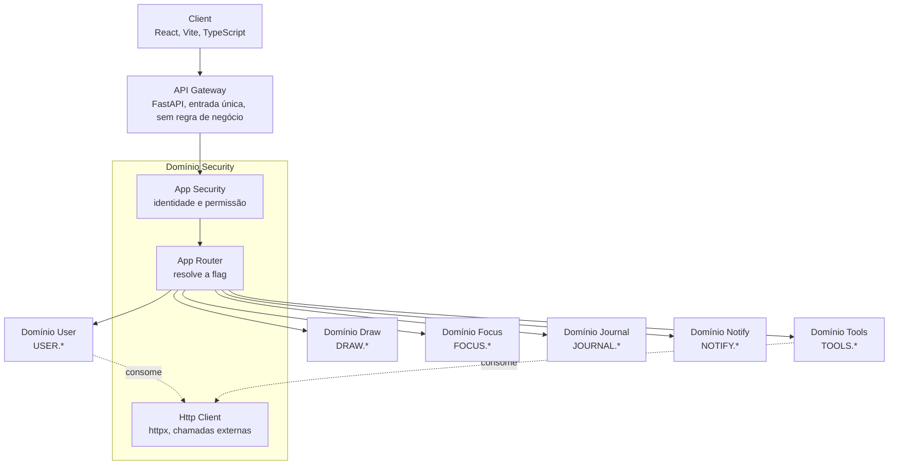

Ordem obrigatória dentro do Security:

1. **App Security** resolve identidade e permissão. Request sem identidade válida morre aqui. É uma dependência do FastAPI (`Depends`), não um middleware solto — dependência é testável isoladamente e declara o que devolve.
2. **App Router** só roda depois. Ele resolve destino, nunca autorização.
3. **Http Client** é um `httpx.AsyncClient` único, com timeout e política de retry configurados no core. Nenhum domínio instancia cliente próprio.

---

## 3. Contrato de flag

A flag é o único mecanismo de roteamento. Formato `DOMINIO.SUBDOMINIO`, em maiúsculas.

```
POST /api/dispatch
X-Domain-Flag: USER.LOGIN
Content-Type: application/json
```

```python
from dataclasses import dataclass


@dataclass(frozen=True, slots=True)
class Flag:
    domain: str
    subdomain: str

    @classmethod
    def parse(cls, raw: str) -> "Flag":
        parts = raw.split(".")
        if len(parts) != 2 or not all(parts):
            raise InvalidFlagError(raw)
        return cls(parts[0].upper(), parts[1].upper())
```

`frozen=True` dá hashable e imutável — a flag é chave de dicionário no registry. `slots=True` corta o `__dict__` de milhares de instâncias por minuto.

### Endpoint de dispatch

```python
@app.post("/api/dispatch")
async def dispatch(
    request: Request,
    raw_flag: Annotated[str, Header(alias="X-Domain-Flag")],
    context: Annotated[RequestContext, Depends(app_security)],
) -> JSONResponse:
    return await router.dispatch(Flag.parse(raw_flag), await request.json(), context)
```

O gateway não conhece domínio nenhum. Ele conhece `Flag`, `RequestContext` e o router.

### Registry do router

O router **não** tem cadeia de `if` nem `match` sobre flags. Ele lê um registry montado no boot, o que torna domínio novo uma questão de pacote novo, sem tocar no core.

```python
from typing import Protocol, TypeVar

TIn = TypeVar("TIn", contravariant=True)
TOut = TypeVar("TOut", covariant=True)


class DomainHandler(Protocol[TIn, TOut]):
    def handle(self, payload: TIn, context: RequestContext) -> TOut: ...
```

```python
@domain_flag(domain="USER", subdomain="LOGIN")
class LoginHandler:
    def __init__(self, service: LoginService) -> None:
        self._service = service

    def handle(self, payload: LoginRequest, context: RequestContext) -> LoginResponse:
        # delega para o service, nunca decide regra aqui
        ...
```

`Protocol` substitui a interface: o handler não herda de nada, o mypy é que verifica se a assinatura bate. Handler que não implementa o contrato quebra no type check, não em produção.

### Descoberta sem o core importar domínio

A varredura de anotação do Java vira **entry points**. Cada domínio se anuncia; o core lê o que foi anunciado. Isso preserva a regra de dependência: `core` nunca faz `import domain_user`.

```toml
# domain_user/pyproject.toml
[project.entry-points."leadboard.handlers"]
user = "domain_user.registry:handlers"
```

```python
from importlib.metadata import entry_points


def build_registry() -> dict[Flag, HandlerFactory]:
    registry: dict[Flag, HandlerFactory] = {}
    for entry in entry_points(group="leadboard.handlers"):
        for flag, factory in entry.load()().items():
            if flag in registry:
                raise DuplicateFlagError(flag)
            registry[flag] = factory
    return registry
```

O `sealed` do Java acusava handler órfão em tempo de compilação. Aqui a rede de proteção é dupla: o registry é construído **no boot** e explode na subida com flag duplicada, e um teste de contrato percorre todas as flags declaradas em `shared_contracts` exigindo handler registrado para cada uma. Flag sem handler em runtime retorna erro de contrato (`422`), nunca `500`.

---

## 4. Domínios e micro-domínios

Um **domínio** é uma capacidade de negócio. Um **micro-domínio** é uma unidade dentro dela com regra própria, estado próprio e motivo próprio para mudar.

Critério de corte: se dois micro-domínios sempre mudam juntos, eles eram um só — vira caso de uso interno, não pacote.

### Domínio User

| Bloco | Micro-domínio | Flag |
| --- | --- | --- |
| Identidade | login | `USER.LOGIN` |
| Identidade | register | `USER.REGISTER` |
| Identidade | session | `USER.SESSION` |
| Credenciais | password | `USER.PASSWORD` |
| Credenciais | mfa | `USER.MFA` |
| Credenciais | recovery | `USER.RECOVERY` |
| Perfil e acesso | profile | `USER.PROFILE` |
| Perfil e acesso | preferences | `USER.PREFERENCES` |
| Perfil e acesso | permissions | `USER.PERMISSIONS` |

### Fronteira com o domínio Security

- `USER.LOGIN` verifica credencial e **pede** a emissão do token ao App Security. Não gera token sozinho.
- O App Security valida o token das requests seguintes e nunca importa `domain_user`.
- `permissions` é a fonte de verdade das permissões. O App Security consome por contrato, com cache. Sem dependência de pacote entre os dois.
- `register` e `recovery` não enviam e-mail nem SMS. Publicam evento; o domínio Notify entrega.

Fora do domínio User: auditoria de acesso, que é domínio transversal próprio.

### Domínio Tools — `TOOLS.*`

Origem: **MChiodi-Tools**. São 44 ferramentas em 8 categorias (devtools 12, conversores 10, design 5, segurança 4, documentos 4, texto 3, seo 3, rede 3).

Aplicando o princípio 8: **41 delas não geram flag nenhuma.** Gerador de UUID, formatador de JSON, conversor CSV↔JSON, minificador, decodificador JWT, gerador de hash, seletor de cor — tudo função pura, roda no navegador e nunca sai da máquina. Transformar isso em endpoint seria trocar uma resposta instantânea por um round-trip.

Só três tocam rede: `BuscaCEP`, `DnsLookup` e `IpLocator`.

| Bloco | Micro-domínio | Flag |
| --- | --- | --- |
| Consulta externa | cep | `TOOLS.CEP` |
| Consulta externa | dns | `TOOLS.DNS` |
| Consulta externa | ip | `TOOLS.IP` |
| Uso pessoal | favorites | `TOOLS.FAVORITES` |
| Uso pessoal | history | `TOOLS.HISTORY` |

Por que as três sobem para o backend: chamada a terceiro sai pelo Http Client do domínio Security, com timeout, retry e chave de API que não pode existir em bundle de frontend. Navegador falando direto com o provedor é CORS quebrado hoje e chave vazada amanhã.

O catálogo em si (`data/tools.ts`) continua estático no frontend — ele não muda por usuário. Só favoritos e "ferramentas usadas recentemente" justificam estado no servidor.

### Domínio Draw — `DRAW.*`

Origem: **MChiodi-InfraDraw**. Canvas React Flow, undo/redo, zoom e pan, alinhamento de nós, editor de blocos e export para PNG/SVG/PDF continuam **inteiramente no cliente**.

Export nunca vira request. Mandar DOM para o servidor rasterizar é trocar uma operação instantânea por uma fila de jobs, um headless browser e um problema de fonte.

| Bloco | Micro-domínio | Flag |
| --- | --- | --- |
| Diagrama | diagram | `DRAW.DIAGRAM` |
| Diagrama | version | `DRAW.VERSION` |
| Colaboração | share | `DRAW.SHARE` |
| Biblioteca | preset | `DRAW.PRESET` |

O que muda em relação ao InfraDraw atual: o `localStorage` deixa de ser fonte de verdade e vira cache de rascunho. Isso é o ponto de atrito real da integração — o `useAutoSave` hoje grava a cada 2 segundos de inatividade, o que é perfeito em memória local e desastroso contra arquivo em disco, porque vira reescrita completa do diagrama a cada 2 segundos, com lock e `fsync` no caminho.

Regra: o debounce local de 2s permanece como está; o sync ao servidor acontece a cada 30s ou no blur da aba, sempre com número de versão no payload. Versão divergente devolve `409` e o cliente resolve. Sem isso, duas abas abertas se sobrescrevem em silêncio.

`DRAW.SHARE` depende de permissão, que é fonte de verdade de `USER.PERMISSIONS` — consumida por contrato, nunca por import.

### Domínio Focus — `FOCUS.*`

Origem: **MChiodi-Focus**.

| Bloco | Micro-domínio | Flag |
| --- | --- | --- |
| Execução | task | `FOCUS.TASK` |
| Execução | goal | `FOCUS.GOAL` |
| Conhecimento | note | `FOCUS.NOTE` |
| Tempo | pomodoro | `FOCUS.POMODORO` |
| Tempo | event | `FOCUS.EVENT` |
| Ambiente | workspace | `FOCUS.WORKSPACE` |

Fica no cliente e não gera flag: a contagem regressiva do timer, os efeitos visuais, o player do YouTube e o gerenciador de janelas. **O servidor guarda sessão concluída, não tique-taque** — timer é estado de UI, histórico é dado.

`FOCUS.NOTE` cobre os snippets de código e prompt, que são markdown com metadado. `FOCUS.EVENT` é o calendário próprio; integração com agenda externa, se um dia existir, é consumo do Http Client e não muda o micro-domínio.

`FOCUS.WORKSPACE` versus `USER.PREFERENCES`: preferência de conta (tema, idioma, fuso) é do User; posição de janela, ordem do dock e qual app abre no login é do Focus. Pelo critério da seção 4, os dois mudam por motivos diferentes e em ritmos diferentes — logo, são dois.

### Domínio Journal — `JOURNAL.*`

Registro do que aconteceu no dia e origem do relatório que vai para a gestão. É o único domínio do LeadBoard cujo produto final é lido por outra pessoa — e isso muda o desenho inteiro.

| Bloco | Micro-domínio | Flag |
| --- | --- | --- |
| Registro | entry | `JOURNAL.ENTRY` |
| Registro | tag | `JOURNAL.TAG` |
| Relatório | report | `JOURNAL.REPORT` |
| Relatório | template | `JOURNAL.TEMPLATE` |
| Apoio | summary | `JOURNAL.SUMMARY` |

#### Entrada e relatório são coisas separadas

`ENTRY` é escrito em dez segundos, no meio do incidente, sem revisão. `REPORT` é montado no fim da semana, revisado e enviado. Ritmos diferentes, motivos de mudança diferentes: pelo critério da seção 4, dois micro-domínios, não um.

Se virassem um só, todo ajuste no formato do relatório mexeria no caminho de escrita rápida — que é justamente o que precisa ser instantâneo, ou o diário não é preenchido.

#### Visibilidade é campo obrigatório, não opcional

Uma entrada tem `visibility`: `PRIVATE` ou `REPORTABLE`. O diário de tech lead contém observação crua — alguém travou, alguém entregou tarde, uma decisão foi ruim. Isso precisa existir para você lembrar, e **não pode** vazar para o relatório por esquecimento.

O default é `PRIVATE`. Promover para `REPORTABLE` é ato explícito. O service de `REPORT` filtra por esse campo antes de qualquer composição, e existe um teste que falha se uma entrada `PRIVATE` aparecer no resultado — esse é o teste mais importante do domínio inteiro.

#### Relatório enviado é snapshot, nunca consulta viva

`REPORT` guarda o texto final que foi enviado, não uma query que recompõe as entradas na hora. Se você editar uma entrada depois do envio, o relatório que a gestão recebeu continua sendo o que ela recebeu.

Relatório que se reescreve sozinho é divergência garantida entre o que está no sistema e o que foi dito — e num documento que sobe para a gestão, isso é o pior defeito possível.

#### O diário se preenche sozinho por evento, não por consulta

A parte difícil de um diário não é escrever, é lembrar. Metade do dia já está registrada em outros domínios: tarefa concluída no Focus, pomodoro fechado, diagrama criado no Draw.

`domain_journal` **não** consulta `domain_focus` — isso quebraria o princípio 3. Ele assina eventos:

| Evento publicado | Origem | Efeito |
| --- | --- | --- |
| `TaskCompleted` | `FOCUS.TASK` | rascunho de entrada, `PRIVATE` |
| `GoalReached` | `FOCUS.GOAL` | rascunho de entrada, `PRIVATE` |
| `DiagramShared` | `DRAW.SHARE` | rascunho de entrada, `PRIVATE` |

Entrada derivada de evento nasce como **rascunho**, nunca como registro confirmado, e nunca como `REPORTABLE`. O sistema sugere o que você fez; quem decide o que conta é você.

#### Resumo é sugestão, e ele sai pelo Http Client

`JOURNAL.SUMMARY` condensa um período em texto corrido. Se a implementação usar modelo de linguagem, a chamada sai pelo Http Client do Security como qualquer outra saída externa — com timeout, retry e chave fora do bundle.

Duas regras não negociáveis aqui: o resultado é rascunho que você edita antes de enviar, e o envio é sempre ato manual. Relatório para gestão gerado e disparado sem revisão humana é um incidente esperando data.

#### Envio

`REPORT` não envia e-mail. Ele publica `ReportPublished`; o domínio Notify entrega. Mesmo padrão do `USER.REGISTER` da seção 7.3 — falha na entrega não pode derrubar o registro do relatório.

#### `JOURNAL.ENTRY` versus `FOCUS.NOTE`

Parecem o mesmo (texto em markdown) e não são. Nota é conhecimento atemporal — um snippet, um comando que você sempre esquece, algo que você reusa. Entrada é fato datado, imutável em espírito, que só faz sentido preso àquele dia.

Nota boa é editada até ficar certa; entrada boa não é reescrita. Motivos de mudança diferentes, domínios diferentes.

#### Formato em disco

Uma entrada por arquivo, particionada por mês: `data/journal/entry/2026-09/<uuid>.json`. Pasta com dez mil arquivos soltos é lenta para listar em qualquer sistema de arquivos.

`data`, `tags` e `visibility` vão também para o índice da coleção, porque são os campos de filtro. O corpo em markdown fica só no arquivo — índice com o texto inteiro dentro vira um arquivo gigante relido a cada request.

Busca textual é varredura sobre os arquivos do período, nunca sobre a coleção toda. Com o filtro de data aplicado antes, isso são dezenas de arquivos, não milhares.

### Migração do localStorage

Os três projetos nasceram sem backend. A migração **não é um domínio** e não ganha endpoint especial: na primeira sessão autenticada, o cliente lê a chave local (`InfraDraw-project` e equivalentes), dispara os fluxos normais de criação e marca a migração como feita. Endpoint de importação é dívida permanente para um evento que acontece uma vez por usuário.

---

## 5. Anatomia de um micro-domínio

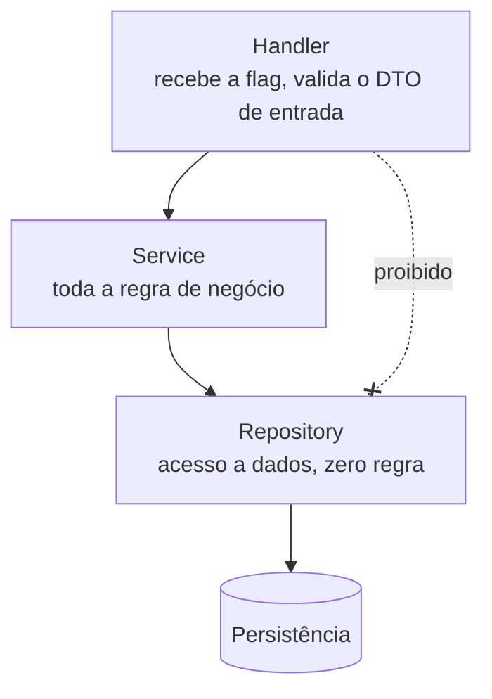

Cada micro-domínio repete essa estrutura. Nenhum atalho: handler não fala com repository.

### Estrutura de pacotes

```
backend/
├─ pyproject.toml            # workspace uv, amarra os membros
├─ core_gateway/
│  ├─ pyproject.toml
│  └─ src/core_gateway/
├─ domain_security/
│  ├─ pyproject.toml
│  └─ src/domain_security/
│     ├─ httpclient/
│     ├─ security/
│     └─ router/
├─ domain_user/
│  ├─ pyproject.toml
│  └─ src/domain_user/
│     ├─ login/
│     ├─ register/
│     ├─ session/
│     ├─ password/
│     ├─ mfa/
│     ├─ recovery/
│     ├─ profile/
│     ├─ preferences/
│     └─ permissions/
├─ domain_tools/
│  ├─ pyproject.toml
│  └─ src/domain_tools/
│     ├─ cep/
│     ├─ dns/
│     ├─ ip/
│     ├─ favorites/
│     └─ history/
├─ domain_draw/
│  └─ src/domain_draw/
│     ├─ diagram/
│     ├─ version/
│     ├─ share/
│     └─ preset/
├─ domain_focus/
│  └─ src/domain_focus/
│     ├─ task/
│     ├─ goal/
│     ├─ note/
│     ├─ pomodoro/
│     ├─ event/
│     └─ workspace/
├─ domain_journal/
│  └─ src/domain_journal/
│     ├─ entry/
│     ├─ tag/
│     ├─ report/
│     ├─ template/
│     └─ summary/
├─ domain_notify/
├─ shared_storage/          # JsonStore: escrita atômica, lock, índice
└─ shared_contracts/
```

Cada micro-domínio é uma pasta com `handler.py`, `service.py`, `repository.py`, `mappers.py` e `tests/`. Layout `src/` é obrigatório: sem ele o pacote é importado do diretório de trabalho e o teste passa a mentir sobre o que está realmente instalado.

`shared_contracts` contém apenas modelos Pydantic de DTO e a definição de `Flag`. `shared_storage` contém apenas a mecânica de gravar e ler arquivo. Os dois podem ser importados por qualquer domínio e não importam ninguém — inclusive um ao outro.

### Regras de dependência

| Origem | Pode importar |
| --- | --- |
| `core_gateway` | `domain_security`, `shared_contracts` |
| `domain_security` | `shared_contracts`, `shared_storage` |
| `domain_*` (negócio) | `shared_contracts`, `shared_storage` |
| `shared_storage` | nada |
| `shared_contracts` | nada |

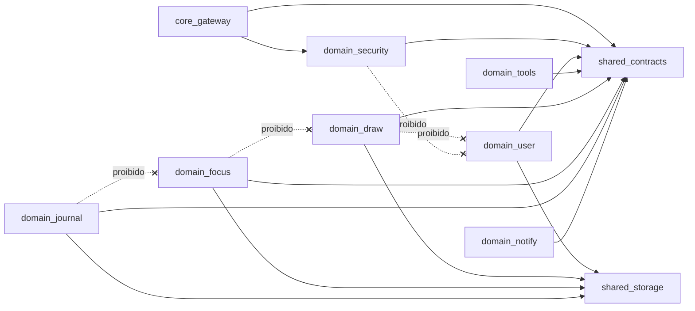

Em Python não existe `provided`/`compile` scope para segurar isso. O papel do enforcer do Maven é do **import-linter**, rodando no CI como etapa que falha o build:

```toml
# .importlinter
[importlinter]
root_packages = [
    "core_gateway",
    "domain_security",
    "domain_user",
    "domain_tools",
    "domain_draw",
    "domain_focus",
    "domain_journal",
    "domain_notify",
    "shared_storage",
    "shared_contracts",
]

[[importlinter.contracts]]
name = "Domínio nunca importa domínio"
type = "independence"
modules = [
    "domain_user",
    "domain_tools",
    "domain_draw",
    "domain_focus",
    "domain_journal",
    "domain_notify",
]

[[importlinter.contracts]]
name = "Security não conhece negócio"
type = "forbidden"
source_modules = ["domain_security"]
forbidden_modules = [
    "domain_user",
    "domain_tools",
    "domain_draw",
    "domain_focus",
    "domain_journal",
]

[[importlinter.contracts]]
name = "Camadas do micro-domínio"
type = "layers"
layers = ["handler", "service", "repository"]
containers = ["domain_draw.diagram", "domain_focus.task", "domain_journal.entry"]

[[importlinter.contracts]]
name = "Infra não conhece negócio"
type = "forbidden"
source_modules = ["shared_storage", "shared_contracts"]
forbidden_modules = [
    "core_gateway",
    "domain_security",
    "domain_user",
    "domain_tools",
    "domain_draw",
    "domain_focus",
    "domain_journal",
]
```

O contrato `layers` é o que impede handler de falar com repository. Não confie em revisão manual: em Python o atalho é uma linha de import que ninguém percebe no diff.

### Persistência em arquivo JSON

Não existe banco. Tudo vive em arquivos JSON numa pasta. **A arquitetura, porém, é desenhada como se existisse um banco** — e isso não é estética: é o que permite trocar o disco por Postgres ou Oracle no dia em que fizer sentido, sem reescrever um único service.

A fronteira que garante isso é o `Protocol` do repository. O service nunca sabe onde o dado está.

```python
class EntryRepository(Protocol):
    def get(self, entry_id: EntryId) -> Entry | None: ...
    def list_by_period(self, start: date, end: date) -> list[Entry]: ...
    def save(self, entry: Entry, expected_version: int) -> Entry: ...
    def delete(self, entry_id: EntryId) -> None: ...
```

Assinatura de banco, implementação de arquivo. Nada no contrato entrega o formato: sem `path`, sem `filename`, sem `flush`. No dia da troca, a implementação SQL preenche o mesmo `Protocol` e a bateria de contrato da seção 8 diz se ela está correta.

### Onde o código de arquivo mora

Escrita atômica, lock e índice são infraestrutura, não contrato — e não podem ser copiados em seis domínios. Por isso o sistema ganha o segundo pacote transversal da tabela de dependências acima, `shared_storage`, com a mesma disciplina de `shared_contracts`: sem regra de negócio, sem conhecer domínio, importando nada.

Ele expõe um `JsonStore` genérico. Ele sabe ler, gravar e listar documento por id numa coleção. Ele não sabe o que é entrada, diagrama ou tarefa.

### Layout da pasta

```
data/
├─ journal/
│  ├─ entry/
│  │  ├─ 2026-09/
│  │  │  ├─ 01H8X...json
│  │  │  └─ 01H8Y...json
│  │  └─ _index.json
│  └─ report/
├─ draw/
│  ├─ diagram/
│  └─ version/
├─ focus/
│  ├─ task/
│  └─ note/
└─ _meta/
   └─ schema_versions.json
```

**Um arquivo por agregado, não um arquivo por coleção.** Coleção inteira num arquivo só significa reescrever tudo a cada salvamento e serializar todo mundo no mesmo lock. Arquivo por agregado mantém a escrita proporcional ao que mudou.

**Id que ordena sozinho.** ULID ou UUIDv7 em vez de UUIDv4: ordenação lexicográfica igual à cronológica, o que dá listagem ordenada de graça, sem abrir arquivo.

### Escrita atômica é obrigatória

Gravar direto por cima do arquivo destrói o dado se o processo morrer no meio — e o que sobra não é a versão antiga nem a nova, é lixo. O padrão é sempre o mesmo:

```python
def write_atomic(path: Path, payload: dict[str, Any]) -> None:
    tmp = path.with_suffix(".tmp")
    with tmp.open("w", encoding="utf-8") as handle:
        json.dump(payload, handle, ensure_ascii=False, indent=2, sort_keys=True)
        handle.flush()
        os.fsync(handle.fileno())
    os.replace(tmp, path)
```

Quatro detalhes que não são opcionais:

- O `.tmp` fica **no mesmo diretório** do destino. `os.replace` só é atômico dentro do mesmo sistema de arquivos; usar `/tmp` quebra a garantia.
- `fsync` antes do replace. Sem ele, o `os.replace` pode chegar ao disco antes do conteúdo e o resultado é um arquivo vazio depois de uma queda de energia.
- `ensure_ascii=False` e `indent=2` porque acento precisa ser legível e diff precisa ser diff.
- `sort_keys=True` para que o mesmo dado gere sempre o mesmo texto — sem isso, cada gravação vira um diff falso.

### Concorrência: o problema que arquivo não resolve sozinho

Banco resolve escrita simultânea por você. Arquivo não.

O repository é síncrono e o FastAPI roda handler síncrono no threadpool — logo, **múltiplas threads** podem gravar o mesmo arquivo ao mesmo tempo. Duas defesas, nessa ordem:

1. **Lock por caminho dentro do processo.** Um `threading.Lock` por arquivo, guardado num dicionário. Resolve o caso normal.
2. **Versão otimista no agregado.** Todo documento carrega `version: int`. `save` recebe `expected_version` e, se não bater com o que está em disco, levanta `VersionConflictError`, que o handler traduz em `409`.

A versão otimista não é redundância do lock: ela cobre o caso real do LeadBoard, que é a mesma aba aberta em dois lugares editando o mesmo diagrama. É também o que sustenta o `409` do domínio Draw e o `DRAW.VERSION`.

Se um dia a aplicação subir com `uvicorn --workers 2`, o lock de thread deixa de valer e é preciso lock de arquivo (`fcntl.flock` ou a biblioteca `filelock`). Enquanto for um processo só, não vale pagar esse custo — mas a decisão precisa estar escrita, porque o dia em que alguém aumentar o número de workers a corrupção é silenciosa.

### Índice: o substituto do `WHERE`

Sem banco não existe query. Abrir quatro mil arquivos para listar as entradas de setembro é inviável, então cada coleção mantém um `_index.json` com só os campos de filtro:

```json
{
  "schema_version": 1,
  "entries": [
    { "id": "01H8X...", "date": "2026-09-14", "tags": ["incidente"], "visibility": "PRIVATE", "version": 3 }
  ]
}
```

Duas regras sobre o índice:

- **Ele é derivado, nunca fonte de verdade.** O arquivo do agregado manda. Se o índice divergir ou corromper, um comando o reconstrói varrendo a pasta. Índice que não pode ser reconstruído é um banco de dados mal feito com outro nome.
- **Atualização do índice entra no mesmo lock da escrita do agregado.** Senão o arquivo existe e o índice não sabe — que é exatamente o bug mais difícil de achar nesse desenho.

### Versão de schema e migração

Todo documento carrega `schema_version`. Ao ler, o repository aplica as migrações pendentes em memória e devolve o modelo atual; a gravação seguinte já persiste no formato novo.

Isso não é excesso de zelo: seu diário de 2026 vai ser lido pelo LeadBoard de 2028. Campo renomeado sem migração transforma registro histórico em erro de validação do Pydantic.

### Consequências que valem a pena

- **Git é o backup e o histórico.** A pasta `data/` num repositório dá versionamento, diff e restauração sem escrever uma linha. É o melhor efeito colateral desse desenho — e vale lembrar que, se o remoto for público, todo o diário vai junto.
- **Teste sem infraestrutura.** Repository testa contra `tmp_path` do pytest. Sem container, sem schema, sem fixture de banco.
- **Inspeção direta.** Deu problema? Abre o arquivo.

### Limites, ditos antes de doerem

- Ordem de grandeza confortável: dezenas de milhares de documentos por coleção. Acima disso, o índice vira o gargalo e a conversa passa a ser SQLite — que continua sendo arquivo único e já resolve lock, índice e transação.
- Nada de junção entre coleções. Se dois agregados precisam ser lidos juntos e consistentes, provavelmente eram um agregado só.
- **Repository continua síncrono.** I/O de arquivo bloqueia igual driver de banco. Handler que toca disco é `def`, não `async def`, e o FastAPI o executa no threadpool. Marcar como `async def` e chamar `open()` dentro trava o event loop inteiro.

---

## 6. Frontend

Nada muda aqui: a troca de linguagem foi só no backend. O frontend continua conhecendo flag e DTO, nunca URL.

### Estrutura

```
frontend/src/
├─ core/
│  ├─ http/          client + injeção automática da flag
│  ├─ security/      sessão, guards de rota
│  └─ router/        mapa flag -> chamada
├─ shell/
│  ├─ WindowManager/ janelas, foco, z-index
│  ├─ Dock/          apps abertos e atalhos
│  └─ registry.ts    registro de janelas do produto
├─ domains/
│  ├─ user/
│  │  ├─ login/
│  │  ├─ register/
│  │  └─ profile/
│  ├─ tools/
│  │  ├─ catalog/    busca e categorias
│  │  └─ [44 ferramentas]
│  ├─ draw/
│  │  ├─ canvas/     React Flow, undo/redo, zoom
│  │  ├─ editor/     bloco, aresta, alinhamento
│  │  └─ export/     PNG, SVG, PDF (client-side)
│  ├─ focus/
│  │  ├─ task/
│  │  ├─ note/
│  │  ├─ pomodoro/
│  │  ├─ calendar/
│  │  ├─ goal/
│  │  └─ player/     YouTube, sem backend
│  └─ journal/
│     ├─ quick-entry/ captura rápida, atalho global
│     ├─ timeline/    o que aconteceu, por dia
│     └─ report/      compositor e revisão antes do envio
├─ design-system/
│  ├─ tokens/        cores, espaçamento, tipografia
│  ├─ components/    Button, Input, Card, Modal, Window, Toast...
│  └─ theme/         provider e variantes
└─ shared/           hooks, utils, types
```

`domains/` espelha o backend 1:1 — com uma assimetria esperada: `domains/tools/` tem 44 pastas e o backend tem 5 micro-domínios, porque 41 ferramentas são puras. Isso é o princípio 8 visível na árvore de diretórios, não um erro de espelhamento.

Nenhuma tela monta URL na mão — o `httpClient` injeta o header da flag.

### Shell unificado

O Focus já tem o que falta aos outros dois: `WindowManager`, `MacWindow` e `Dock`. Em vez de três abas separadas, o LeadBoard usa esse shell como casca do produto inteiro — Tools, InfraDraw e Focus viram janelas dentro dele.

O `data/apps.jsx` do Focus deixa de ser a lista de apps do Focus e vira o **registro de janelas do LeadBoard**, espelhando no frontend exatamente o que o registry de flags faz no backend: app novo é entrada nova no registro, sem tocar no shell.

Consequência prática de unificar os três repositórios: `Header`, `BackToTop`, `Loader`, `Toast` e `SearchBar` existem hoje duplicados — `Header` está nos três projetos, `BackToTop` em Tools e em Focus. No LeadBoard cada um existe **uma vez**, no design system, com variante. A regra 7 deixa de ser teórica no dia da migração: é o momento em que três versões de `Header` precisam virar uma.

Dívida conhecida e herdada: `Canvas.tsx` do InfraDraw tem 689 linhas e é o único arquivo dos três projetos que estoura o limite de 400. A quebra já está meio feita — o repositório isolou `useUndoRedo`, `useAutoSave`, `useTheme` e `useToast`. O que falta extrair é a seleção e o alinhamento de nós, e a ligação de arestas. Isso é pré-requisito de merge, não ajuste posterior.

### Regra dos 400 linhas

**Todo componente e toda página têm no máximo 400 linhas.** Não é meta, é limite de build.

```js
// eslint.config.js
rules: {
  'max-lines': ['error', { max: 400, skipBlankLines: true, skipComments: true }],
  '@typescript-eslint/no-explicit-any': 'error',
}
```

Quando o arquivo estoura, a saída não é apertar o código. É extrair:

1. Lógica de estado para um hook (`useLoginForm`).
2. Blocos visuais repetidos para componentes do design system.
3. Subseções da página para componentes locais na própria pasta.
4. Chamadas de API para a camada `core/http`.

Um componente por pasta, com `index.ts`, o `.tsx`, o teste e a story juntos.

### Componentes reutilizáveis via tema

O design system é a única fonte de estilo. Um botão existe **uma vez** e serve todos os contextos por variante, nunca por arquivo duplicado (`ButtonPrimary`, `ButtonSmall`, `ButtonDanger` são anti-padrão).

Tokens vivem como CSS variables, o que permite trocar tema inteiro sem tocar em componente:

```css
:root {
  --color-accent: #ff5555;
  --color-surface: #101014;
  --color-text: #f5f5f5;
  --radius-md: 8px;
}
```

Variantes declaradas em um único lugar:

```tsx
const button = cva('inline-flex items-center justify-center rounded-md transition', {
  variants: {
    variant: {
      primary: 'bg-accent text-surface hover:opacity-90',
      secondary: 'border border-accent text-accent',
      ghost: 'text-text hover:bg-white/5',
      danger: 'bg-red-600 text-white',
    },
    size: {
      sm: 'h-8 px-3 text-sm',
      md: 'h-10 px-4 text-sm',
      lg: 'h-12 px-6 text-base',
    },
  },
  defaultVariants: { variant: 'primary', size: 'md' },
});
```

Regras do design system:

- Componente de domínio **não** define cor, sombra ou espaçamento literal. Só consome token.
- Nova necessidade visual vira variante nova no componente base, não componente novo.
- Componente do design system não conhece domínio: `Button` não sabe o que é login.
- Componentes são funcionais e puros. Todo `useEffect` com assinatura, listener ou timer tem função de cleanup.

### Storybook obrigatório

**Todo componente do design system tem story.** Componente sem story não entra na branch principal.

```
frontend/
├─ .storybook/
│  ├─ main.ts
│  └─ preview.ts     ThemeProvider global + backgrounds do tema
└─ src/design-system/components/Button/
   ├─ Button.tsx
   ├─ Button.test.tsx
   ├─ Button.stories.tsx
   └─ index.ts
```

```tsx
const meta: Meta<typeof Button> = {
  title: 'Design System/Button',
  component: Button,
  args: { children: 'Confirmar' },
};
export default meta;

export const Primary: Story = { args: { variant: 'primary' } };
export const Secondary: Story = { args: { variant: 'secondary' } };
export const Danger: Story = { args: { variant: 'danger' } };
export const Loading: Story = { args: { isLoading: true } };
export const Disabled: Story = { args: { disabled: true } };
```

O que a story precisa cobrir:

- Uma story por variante e por estado relevante: default, hover documentado, loading, disabled, erro, vazio.
- Todos os tamanhos disponíveis.
- Comportamento com texto longo e com conteúdo mínimo.
- Addon de acessibilidade ligado; violação reportada é bug, não aviso.
- O Storybook roda com o `ThemeProvider` real do app, não com estilos improvisados.

O Storybook é a documentação viva do design system. Antes de criar componente novo, a consulta obrigatória é ao Storybook — se já existe algo que resolve por variante, não se cria arquivo novo.

---

## 7. Exemplos de fluxo de uso

Cenários reais, do clique até a resposta. Servem de referência para implementar qualquer fluxo novo.

### 7.1 Login — `USER.LOGIN`

Rota pública: o App Security deixa passar sem identidade, mas continua sendo o único que emite token.

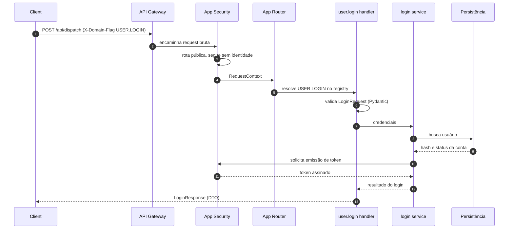

Pontos que costumam ser violados aqui: o service **não** assina token por conta própria, e o handler **não** consulta o banco.

```python
class LoginRequest(BaseModel):
    model_config = ConfigDict(frozen=True, extra="forbid")

    email: EmailStr
    password: SecretStr
```

`extra="forbid"` é o que faz a validação de entrada ser um contrato de verdade: campo desconhecido vira `422`, não vira campo ignorado em silêncio. `SecretStr` impede que a senha vaze em log ou em `repr` de exceção.

### 7.2 Request autenticada — `USER.PROFILE`

O caminho padrão de toda request depois que o usuário já tem token.

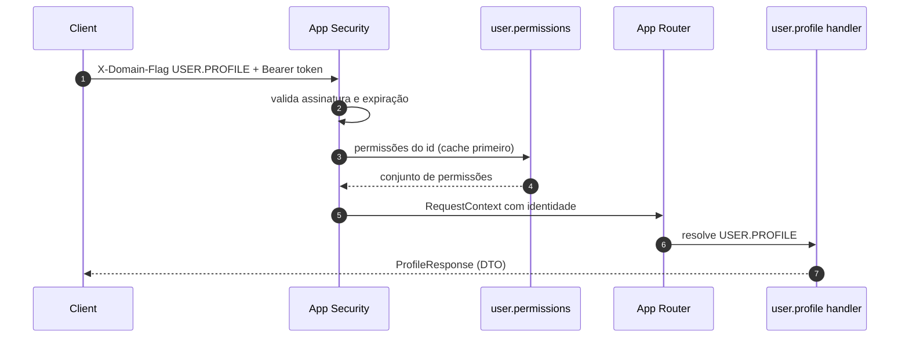

O App Security consulta `permissions` por contrato, não por import de pacote. Cache primeiro; o banco é o último recurso.

### 7.3 Cadastro com efeito colateral — `USER.REGISTER`

Domínio de negócio não envia e-mail. Ele publica evento e devolve resposta na hora.

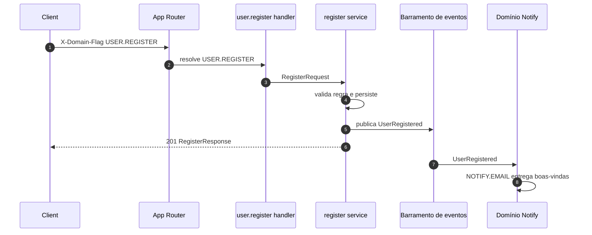

O cliente não espera o e-mail sair. Falha no Notify não derruba o cadastro.

O barramento é injetado como Protocol (`EventBus`), nunca importado direto de uma implementação. `BackgroundTasks` do FastAPI serve para o começo, mas some se o processo morre — quando a entrega precisar ser garantida, a troca acontece dentro do adapter, sem tocar no service.

### 7.4 Permissão negada — `DRAW.SHARE`

Usuário tenta abrir um diagrama que não é dele e não foi compartilhado com ele.

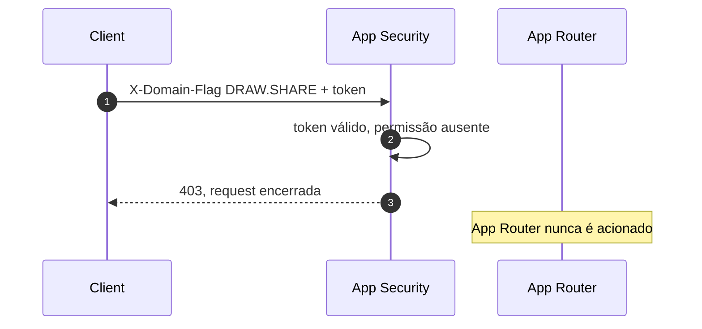

Autorização morre no Security. O domínio de negócio jamais recebe uma request que não deveria executar — `domain_draw` nunca chega a saber que aquele diagrama existe.

### 7.5 Diário automático e relatório para a gestão — `JOURNAL.*`

Dois momentos distintos do mesmo domínio: o registro que acontece sozinho durante a semana e a composição que acontece na sexta.

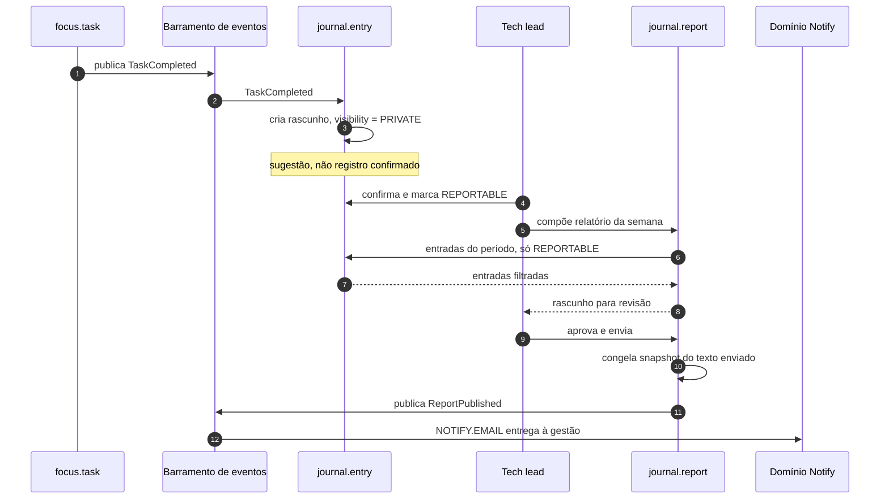

Três violações que esse fluxo torna visíveis se acontecerem:

- `journal.entry` importando `focus.task` para saber o que foi concluído. O caminho é o evento, sempre.
- `journal.report` lendo entrada sem filtrar `visibility`. É o teste que nunca pode ficar vermelho.
- `journal.report` guardando referência às entradas em vez do texto. Depois do envio, o relatório é imutável.

### 7.6 Flag desconhecida

Flag sem handler registrado retorna erro de contrato, não `500`. O registry responde `422` com a flag recebida, e o teste de integração da seção 8 cobre exatamente esse caso.

### 7.7 Frontend consumindo o fluxo

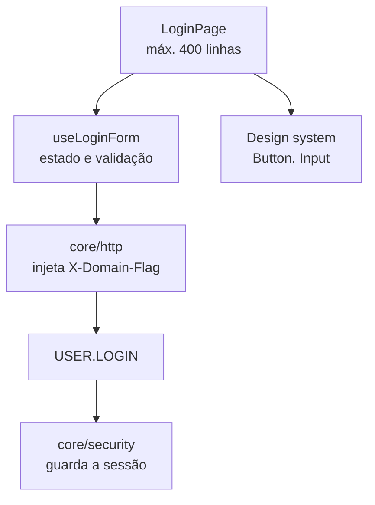

```ts
export function login(payload: LoginRequest) {
  return httpClient.dispatch<LoginResponse>('USER.LOGIN', payload);
}
```

A página não conhece URL, header nem formato de token. Ela conhece a flag e o DTO. Toda a parte visual sai do design system, então a página fica só com composição e fica naturalmente abaixo do limite de linhas.

---

## 8. TDD: teste primeiro, sempre

**Nada é construído antes do seu teste.** Vale para handler, service, repository, hook, componente e página. Sem exceção para "código simples" ou "ajuste rápido".

### Ciclo

1. **Red** — escreve o teste que descreve o comportamento desejado. Roda. Ele **precisa** falhar. Teste que passa de primeira não está testando nada.
2. **Green** — escreve o mínimo de código de produção para o teste passar. Nada além disso.
3. **Refactor** — melhora a estrutura com a suíte verde o tempo todo.

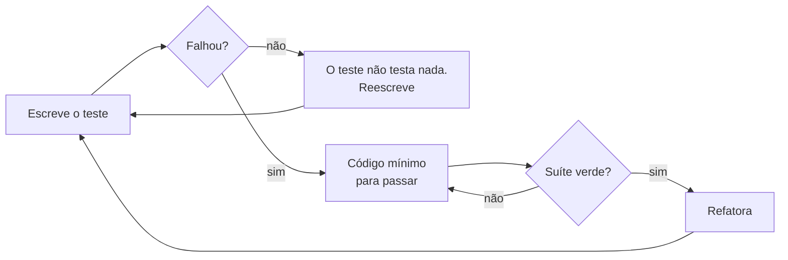

Em Python, "falhou" tem duas formas válidas no Red: `AssertionError` ou `ImportError` do módulo que ainda não existe. A segunda é legítima e é o começo natural de um micro-domínio novo.

### Ordem de escrita por micro-domínio

```
1. teste do Service (regra de negócio, com repository fake)
2. Service
3. teste do Repository (contrato de dados)
4. Repository
5. teste do Handler (contrato de entrada e saída, mapeamento de DTO)
6. Handler
7. teste de integração da flag (request com X-Domain-Flag chega no destino)
8. registro da flag (entry point)
```

O repository fake do passo 1 é uma classe que implementa o mesmo `Protocol` do real — não um `MagicMock`. Mock que aceita qualquer chamada esconde mudança de assinatura; a classe fake quebra no mypy junto com o resto.

### Ordem de escrita no frontend

```
1. teste do componente (comportamento visível, não implementação)
2. componente
3. story cobrindo variantes e estados
4. teste do hook de estado, se houver
5. hook
```

### O que testar

| Camada | Foco | Ferramenta |
| --- | --- | --- |
| Service | regra de negócio, casos de borda, erro | pytest + fakes tipados |
| Repository | leitura, escrita e mapeamento | pytest + `tmp_path` |
| Handler | contrato de entrada e saída | pytest |
| Roteamento por flag | flag válida, inválida, sem handler | pytest + httpx.ASGITransport |
| Registry | toda flag declarada tem handler, nenhuma duplicada | pytest (teste de contrato) |
| Componente | o que o usuário vê e faz | Vitest + Testing Library |
| Hook | transições de estado | Vitest |

### Bateria de contrato do repository

Esse é o teste que transforma "a arquitetura é como se existisse um banco" de intenção em fato verificável.

Para cada `Protocol` de repository existe **uma** bateria de testes escrita contra o contrato, não contra a implementação. Ela roda hoje contra o `JsonEntryRepository` e, no dia em que existir um `SqlEntryRepository`, roda contra ele sem alterar uma linha:

```python
class EntryRepositoryContract:
    """Herdado por cada implementação. Nenhum teste aqui conhece arquivo ou SQL."""

    @pytest.fixture
    def repository(self) -> EntryRepository:
        raise NotImplementedError

    def test_salva_e_recupera(self, repository: EntryRepository) -> None: ...
    def test_id_inexistente_devolve_none(self, repository: EntryRepository) -> None: ...
    def test_periodo_filtra_pelas_bordas(self, repository: EntryRepository) -> None: ...
    def test_versao_divergente_levanta_conflito(self, repository: EntryRepository) -> None: ...


class TestJsonEntryRepository(EntryRepositoryContract):
    @pytest.fixture
    def repository(self, tmp_path: Path) -> EntryRepository:
        return JsonEntryRepository(JsonStore(tmp_path))
```

Se um teste da bateria precisar saber que existe arquivo, ele está no lugar errado — vai para a suíte específica do `JsonStore`, junto com escrita atômica, lock e reconstrução de índice. O contrato descreve comportamento de repositório; o `JsonStore` é que tem detalhe de disco.

Teste consulta comportamento, não implementação. No frontend, buscar por texto e papel acessível, nunca por classe CSS ou estrutura interna. No backend, asserir sobre o DTO devolvido, nunca sobre o estado interno do service.

O teste de integração usa `ASGITransport` contra o app em memória, sem subir servidor:

```python
async def test_flag_desconhecida_retorna_422() -> None:
    transport = ASGITransport(app=app)
    async with AsyncClient(transport=transport, base_url="http://test") as client:
        response = await client.post(
            "/api/dispatch",
            headers={"X-Domain-Flag": "USER.NAOEXISTE"},
            json={},
        )
    assert response.status_code == 422
```

### Definition of done

Uma entrega só está pronta quando:

- [ ] O teste foi escrito antes e falhou antes de passar
- [ ] A suíte inteira está verde
- [ ] `mypy --strict` limpo, sem `Any` explícito e sem `# type: ignore` sem justificativa
- [ ] `lint-imports` verde (nenhum domínio importa outro, nenhuma camada pulada)
- [ ] `ruff check` e `ruff format` limpos
- [ ] Nenhum arquivo de componente ou página passa de 400 linhas
- [ ] Nenhum `any` no TypeScript
- [ ] Componente novo do design system tem story com todas as variantes
- [ ] Nenhuma cor ou espaçamento literal fora dos tokens
- [ ] Nenhum `dict` cru de arquivo aparece em resposta HTTP
- [ ] Todo repository novo passa na bateria de contrato compartilhada
- [ ] Nenhuma escrita em disco fora do `JsonStore` (sem `open()` solto em service)
- [ ] Commit segue Conventional Commits

---

## 9. Como adicionar um domínio novo

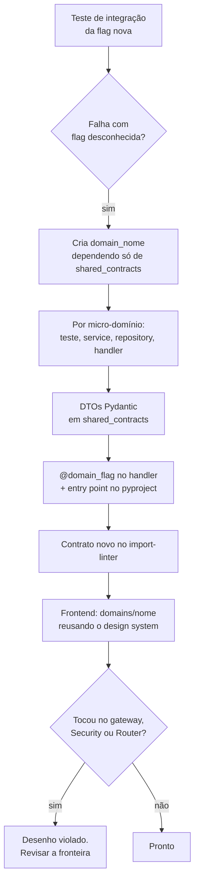

1. Escrever o teste de integração da flag nova. Ele falha: flag desconhecida.
2. Criar o pacote `domain_<nome>` com seu `pyproject.toml`, declarando dependência apenas de `shared_contracts`, e registrá-lo como membro do workspace.
3. Para cada micro-domínio, seguir a ordem de escrita da seção 8.
4. Declarar os DTOs em `shared_contracts` como modelos Pydantic `frozen`.
5. Decorar o handler com `@domain_flag` e publicar o entry point `leadboard.handlers`. O registry o encontra sozinho no boot.
6. Adicionar o pacote novo ao contrato `independence` do import-linter — senão ele nasce fora da rede de proteção.
7. No frontend, criar `domains/<nome>/` espelhando os micro-domínios e reutilizando o design system existente.

Nenhum passo acima toca no gateway, no App Security ou no App Router. Se tocar, o desenho foi violado.
